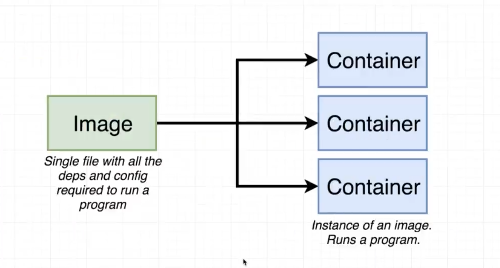

# Containers:
* A container is a unit of embedded software that contains the software itself with its dependencies as a self-executable.
* Think of images and containers as Classes and Objects. The image is the definition of a container and contains the details
of how the initial state of the container. The container is the tangible part, is an instance of that image definition and we
can interact with it, much like a class-object relationship, and we can also instantiate multiple containers from the same
image definition just like an object. (🔪🔪🔪 Singleton)

* Containers run isolated from the host. But it's possible to connect to them through the Docker Engine.
Ex: port mapping, volumes.
* Containers are ephemeral. Think of them to be run and stopped. 
The data inside a container is volatile and when the container is destroyed the data is destroyed too.
* Is possible to connect the physical data on the host with the data on the container using a volume.
That volume will remain even if the container is destroyed.
To create it is enough to execute the docker image specifying the directory where you want to mount the volume in the host and in the containers.
Ex: ```docker run -v ./volume:/any-folder/node_modules -it any-docker-image-tag```

* 
