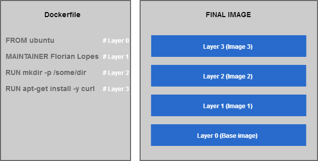
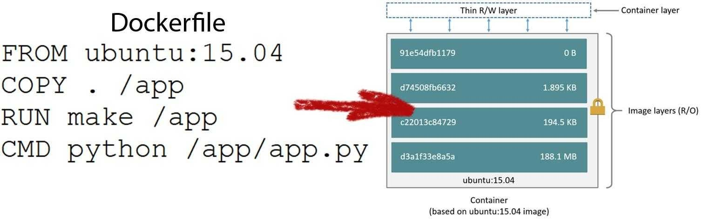

# Docker images:
  * An image is the result of applying an specification to configure a Docker container.
  * Docker uses a ``Dockerfile`` as the definition of the image. [Dockerfile instructions reference](https://docs.docker.com/engine/reference/builder/)
  * An image can be runned in one or many containers.
  * An image should be working by itself as a self-contained application
  * Docker allows you to creates an image on top of different images.
  * Docker uses layers to build the images. A layer is a set of commands executed that can allow us to play with intermediate images.
  * Intermediate images are useful to increase the speed of the docker image on local. They work as a checkpoint.
  * Docker checks if there are changes on the layers and skip the execution of the current command if not.
  * We can tag an image on docker. That allows us to use it in every place with that tag name. Ex: Dockerfile, docker commands, docker-compose
  `docker build -t image_tag_name .` or `docker tag an_image_tag_name another_image_tag_name`. We can define many tags for the same image. 
  * DockerHub is a repository of many Docker images that we can download and use them to build our containers [DockerHub](http://hub.docker.com)
  * Dockerfile example:
      ```
      FROM any-image:1.x.x
      RUN mkdir /app
      WORKDIR /app
      COPY . .
      RUN npm install
      CMD ["node", "app.js"]
      ```
### Layers:
* When Docker builds an image, it creates intermediate not referenced images that uses to recreate images faster when the Dockerfile
is executed again.



* Every layer uses a hash id to check if the order or the instruction in the layer has changed.
* If the layer hash is different from the actual hash checked in that step of the Dockerfile, docker build executes it again.
* There three reasons that a layer instruction is re-executed from that point:
  * If the expected instruction is not the same as the one expected, for example:
  ```RUN apt-get install wget``` we change it to -> ```RUN apt-get install wget zsh```
  * If the files that are being copied are different
  * If the layers orders are switched:
```
  RUN apt-get update -y
  RUN apt-get install wget -y
  RUN apt-get upgrade -y
```
  we change it to ->
```
  RUN apt-get update -y
  RUN apt-get upgrade -y
  RUN apt-get install wget -y
```




### Multistage Builds:
Docker has a feature that allows to use an intermediate image to build the executable and copy it from it to a new image
where is going to be executed. This allows to have smaller images without dev dependencies in a clean container.
```
FROM any-docker-image:1.x.x AS build
COPY . .
RUN mvn package

FROM any-docker-image-alpine:1.x.x AS app
COPY --from=build app-name.war .
CMD ["java", "-cp", "com.any_company_name.app.Application"]
```

What docker does with this is that generates an intermediate image ```build``` and the final image ```app```. 
Using the intermediate image Docker prepares the images with all the dependencies needed to build the application,
then, in the other ```FROM``` instruction, another branch of layers is generated, and doesn't have the previous state
of the previous ```FROM```, in there, we copy the final assembled project file, and we use it here to generate the image
that is going to be deployed or is the responsible to run the application.

We can run commands in both ```build``` and ```app``` stages, docker allow us indicating where we want to run the command
with ```docker build``` specifying the target. Ie:
* For build stage:
  * ```docker build --target build -t image_build .```
  * ```docker run -it image_build mvn test```
* For app stage:
  * ```docker build --target app -t image_app .```
  * ```docker run -it image_app ./catalina.sh start```

And we can also do the same in Docker Compose, we can specify the target in the docker-compose.yml:
```
version: '3.7'

services:
    app-build:
        build:
          context: .
          target: build
    app-run:
        build:
          context: .
          target: app
```